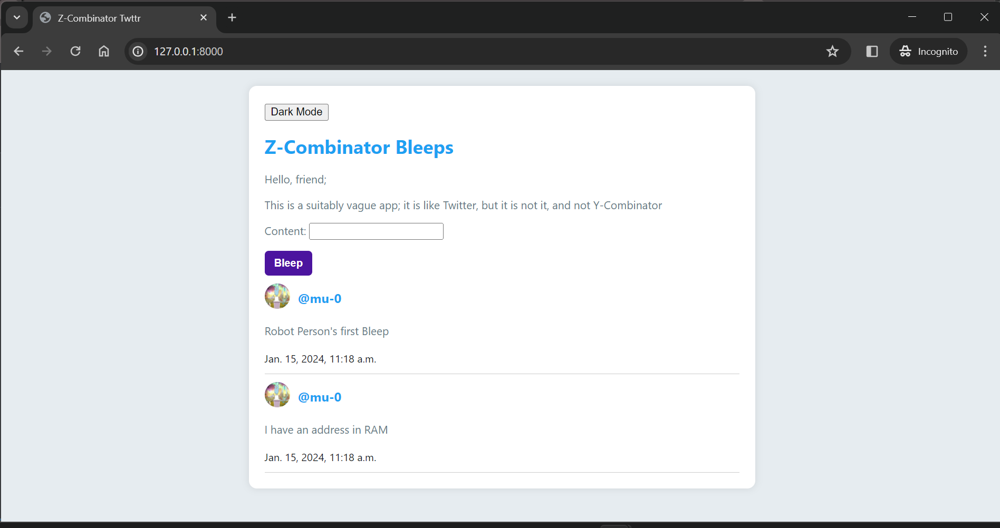

# Z-Combinator Twttr

Z-Combinator Twttr is a Django app for __`typing out thoughts`__. Authenticated users can post short messages (bleeps).

## Setup

1. **GIT:**
   ```shell
   git clone https://github.com/janymuong/z-combinator.git
   cd z-combinator
   ```

2. **Install Dependencies:**
   ```shell
   pip install -r requirements.txt
   ```

3. **Set up Environment Variables:**  
   Create a `.env` file in the project root with the content:
   ```env
   DB_NAME=twttr_bleeps
   DB_USER=db_user # valid user
   DB_PASSWORD=passwd-not-serious
   DB_HOST=localhost
   DB_PORT=5432
   SECRET_KEY=django-insecure#some_lengthy_tring
   ```

4. **Apply Migrations:**
   ```bash
   python manage.py makemigrations
   python manage.py migrate
   ```

5. **Run the Development Server:**
   ```bash
   python manage.py runserver
   ```

6. **Access the Application:**  
   Open your web browser and go to [http://127.0.0.1:8000/](http://127.0.0.1:8000/) to view the Z-Combinator Twttr app.

<p align="center">
  
</p>

## Features

- User registration and authentication
- Posting and viewing short messages (bleeps) - LIKE tweets
- Dark mode toggle
- PostgreSQL database backend
- Environment variable configuration for sensitive data

## Contributing

If you'd like to contribute to the project, feel free to submit issues or pull requests. Your contributions are welcome!

---
[MIT License](LICENSE)
